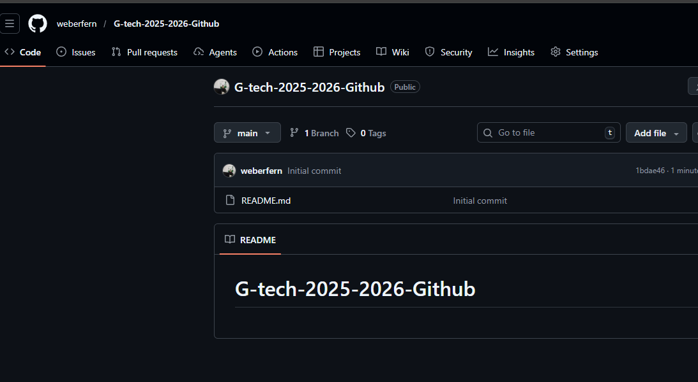

# Bootcamp Geração Tech 3.0 - GitHub

## Descrição
Repositório de atividades do Bootcamp Geração Tech 3.0, focado em aprendizado e prática de Git e GitHub.

## Autor
**Weber Fernandes da Silva**

## Conteúdo
Este projeto inclui exemplos e práticas relacionadas a controle de versão com Git e hospedagem de código no GitHub.

## Imagem do Projeto


## Estrutura
```
.
├── README.md
├── meu_arquivo.txt
└── img/
    └── github.jpg
```

## Como Contribuir
1. Faça um fork do repositório
2. Crie uma branch para sua feature (`git checkout -b feature/MinhaFeature`)
3. Commit suas mudanças (`git commit -m 'Adicionando nova feature'`)
4. Push para a branch (`git push origin feature/MinhaFeature`)
5. Abra um Pull Request

## Licença
Este projeto é parte do Bootcamp Geração Tech 3.0.

---
*Última atualização: Fevereiro de 2026*
